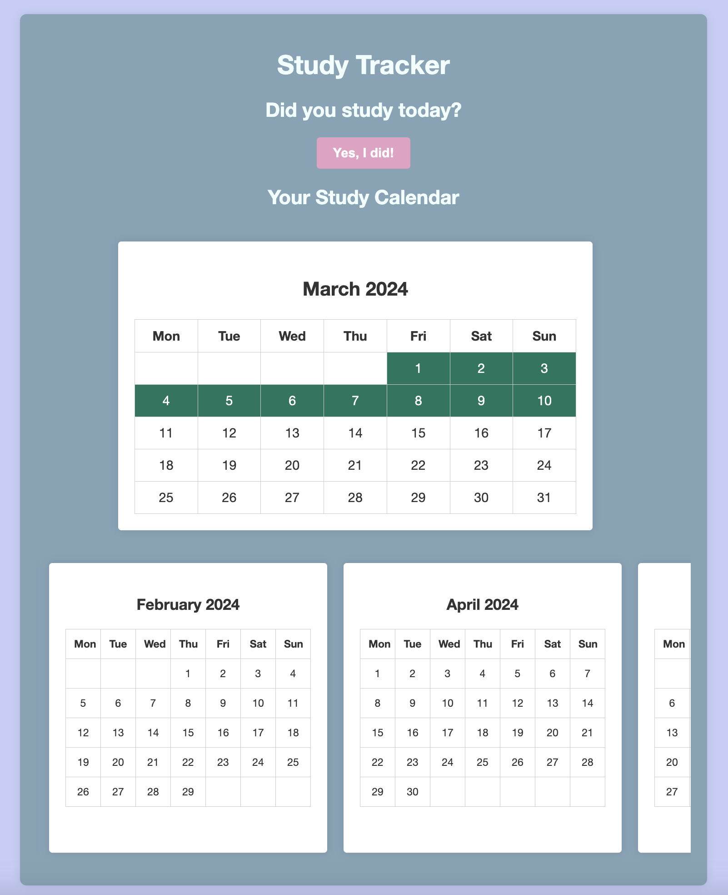

# Study Helper

Study Helper is a web application that helps you keep track of your study habits. It provides a visual calendar where you can mark the days you have studied.

## Features

- Mark the current day as studied with a single click
- View your study history in a monthly calendar format
- The calendar updates dynamically when you mark a day as studied


## Installation

1. Clone this repository:
    ```
    git clone https://github.com/ntcode12/study-helper.git
    ```
2. Navigate to the project directory:
    ```
    cd study-helper
    ```
3. Install the required Python packages:
    ```
    pip install -r requirements.txt
    ```
4. Run the application:
    ```
    python run.py
    ```

## Usage

Open your web browser and navigate to `http://localhost:5000`. Click the "Yes, I did!" button to mark the current day as studied. The calendar will update to reflect this.

## Contributing

Pull requests are welcome. For major changes, please open an issue first to discuss what you would like to change.

## License

[MIT](https://choosealicense.com/licenses/mit/)